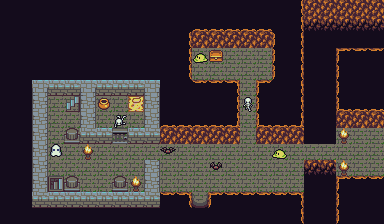

# 地牢卡牌游戏

传统地牢类游戏，结合卡牌机制。玩家没有等级和升级机制，以及装备，道具。仅可进行近距离的普通攻击（如果有职业区分，可以有远程？）

玩家高度依赖一套卡牌机制来进行游戏。玩家拥有一个有限的卡牌仓库（8张？12张？）通过在迷宫中拾取，击败怪物等来获得。如何有效的管理卡牌以及在必要的时刻使用卡牌是突破游戏的核心玩法。

## 地图

游戏会采用传统的2D附视角，玩家在地牢中可4方向移动，地牢为随机生成。一层有固定大小，找到楼梯前往下一层（也可以是平面四方向移动？类似于以撒的结合的地图机制）

## 卡牌

丰富游戏体验，提升可玩性的核心，可富有创意的添加各种玩法和可能性

使用类（一次性使用，用完即消耗）：

* 攻击技能（近战强力攻击，范围横扫，远距离魔法）
* 回复（当血瓶用，一次性回血。回复，慢慢回血）
* 自身特效（短时间无敌，狂暴？）
* 其他（有意思的机制，使用后添加几张随机卡牌？时间回朔？）
* 赌博（凿墙，破坏地形，拿宝箱，随机+-HP等）

属性类（留着就会影响属性，玩家可以自行丢弃）：

* 一般属性（+攻击，防御，HP上限）
* 影响其他卡牌形成combo（火系魔法伤害+1之类）
* 免疫（免疫睡眠，麻痹，赋予正向永久buff）

诅咒类（不良事件导致，怪物的特殊攻击强行赋予之类，无法轻易丢弃）

* 无用累赘（虽然没用，但强行占用卡牌格）
* 诅咒（减少属性，降低攻击防御等）
* 诅咒装备（增加属性，很强，但属于诅咒物品无法轻易丢弃）

## 当前需确认的机制部分

### 职业

卡牌和职业问题，可选职业来决定玩法。还是单一角色，由玩家在之后的流程中，根据获取到不同的卡牌组合来决定玩法？

### 迷雾

默认玩家是否可见当前地图情况？分为以下几类：

* 可见全图
* 半迷雾，可见全图地貌，但只可见视野范围内的元素（怪物，道具）
* 全迷雾，初期不可见地貌，视野探查过的地貌才会被记录，只可见视野范围内的元素

### 终点机制

游戏是否有结局？地牢会有终点？还是无限地牢，看玩家能走多深。